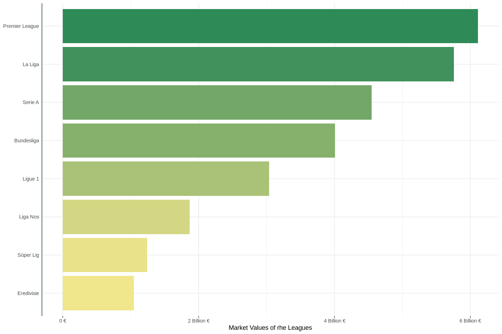
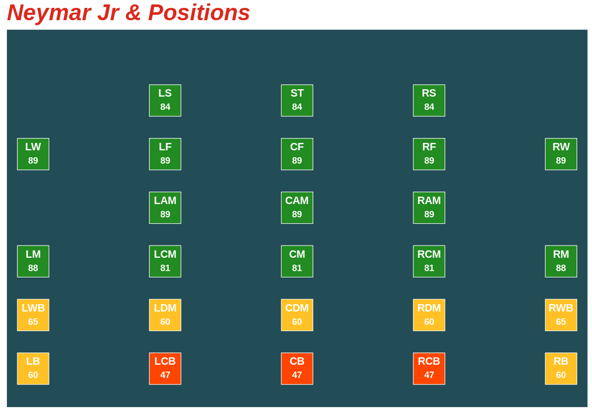
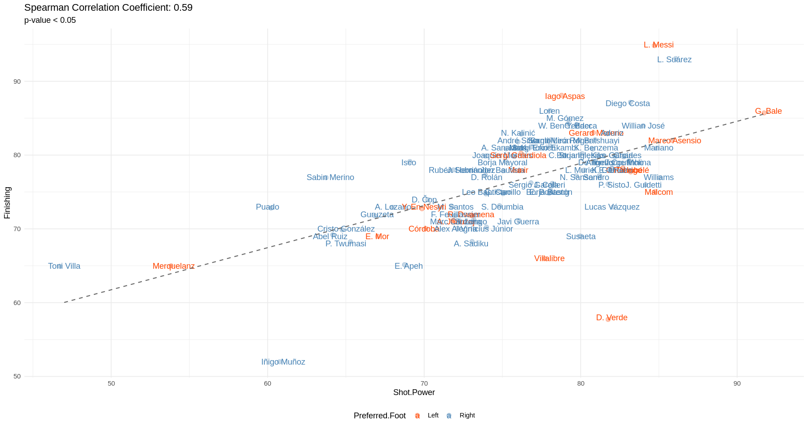
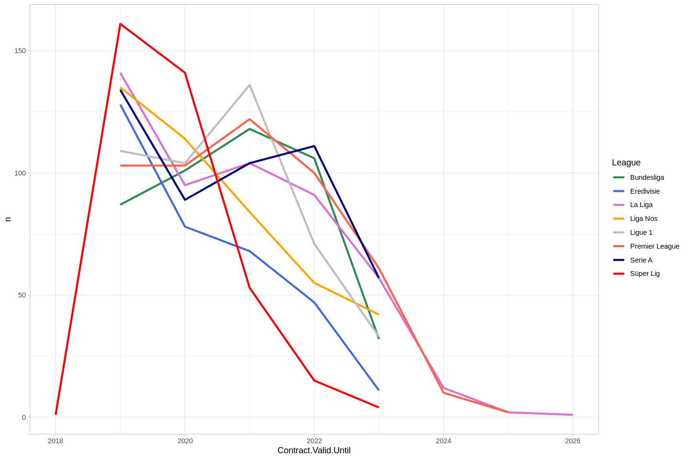
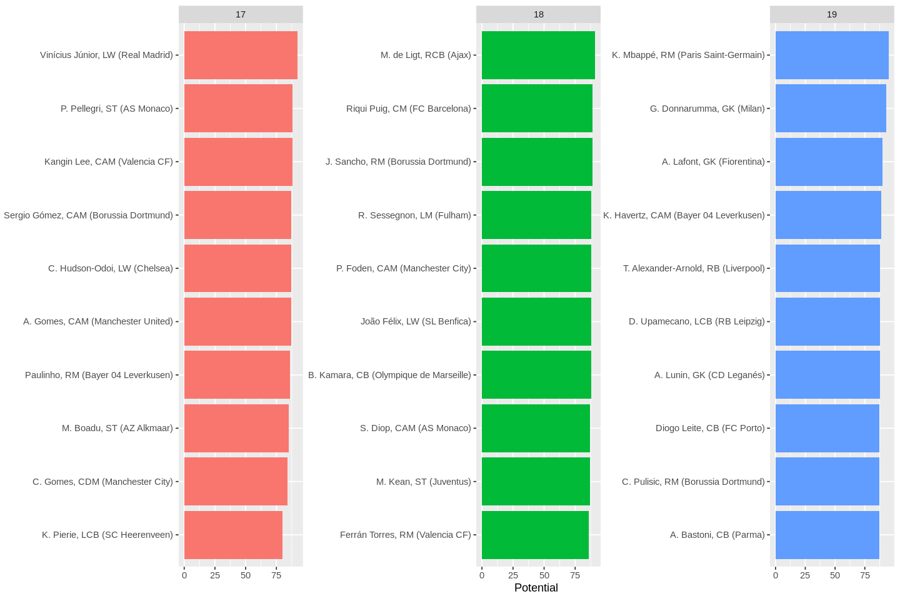

 
<h1 align="center">Predict Positions of Football Players ⚽</h1>
  

  

Using data from FIFA players and their performance metrics, this system can estimate the best position for that football in the squad.

<!-- TABLE OF CONTENTS -->

  
<h2 style="display: inline-block">Table of Contents</h2>

  <ol>
    <li><a href="#technologies-&-dataset">Tech & Dataset</a></li>
    <li><a href="#data-analysis">Data Analysis</a></li>
    <li><a href="#contact">Contact</a></li>
  </ol>

## Technologies & Dataset

* [R](https://www.r-project.org/)

* [Fifa Dataset](https://www.kaggle.com/thec03u5/fifa-18-demo-player-dataset)

<!-- Data Analysis -->

## Data Analysis

1. Finding Distribution and the Average of The Players in each League:

2. Total Market Value in each League:

3. Visualization of the Position:

4.  Correlation between Finishing & Shot Power:

5.  Contract Analysis:

6.  Top 10 Wonderkids:

<!-- CONTACT -->
## Contact

Shreyas  - shreyas.mm@somaiya.edu

Sanyam - sanyam.savla@somaiya.edu
